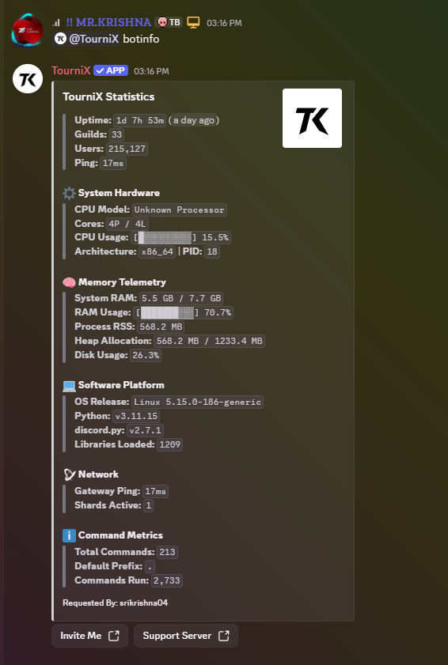
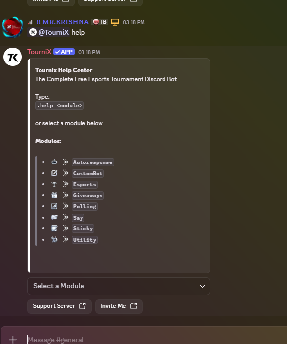
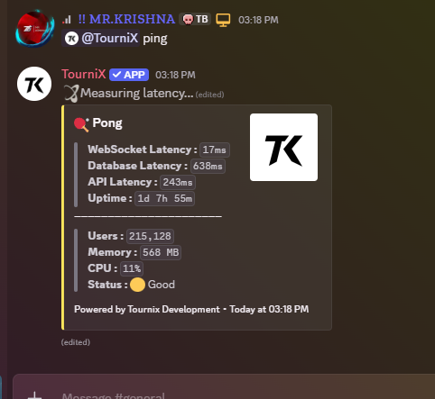
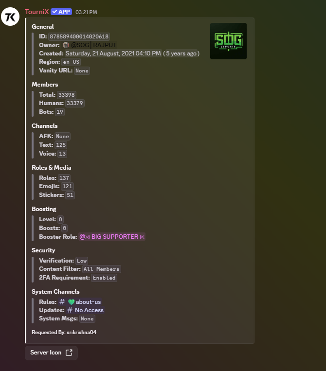
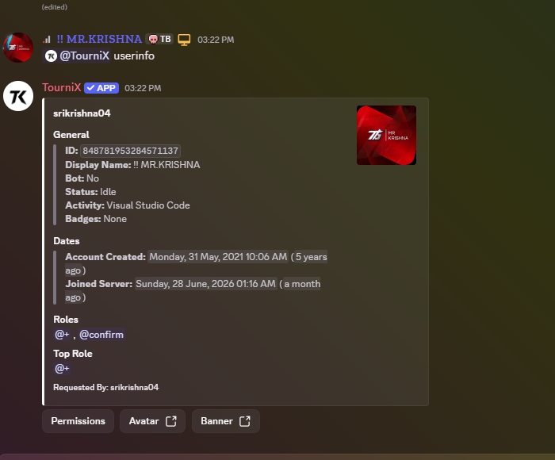
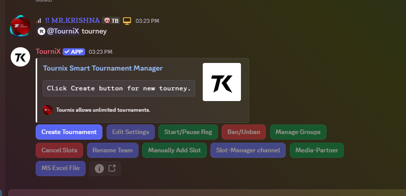
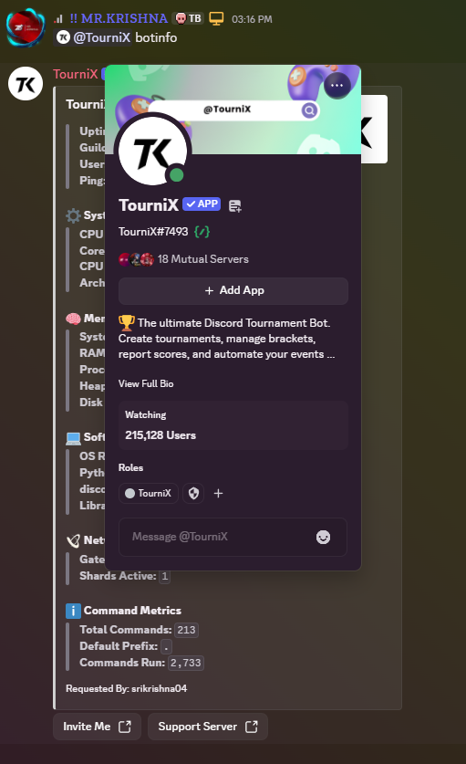

# Tournix Bot

Tournix is a powerful Discord bot designed for community management and esports tournament organization.

## Discord Verification

The following screenshots demonstrate why Tournix requires privileged Discord intents to deliver its full feature set:

### Required Intents

- **Server Members Intent** - Required to access member counts, user information, and server member lists across all guilds
- **Message Content Intent** - Required to process user commands and provide interactive bot functionality

### Screenshots

#### Bot Statistics

Displays uptime, total guilds, total users, CPU, RAM, latency and confirms the bot displays the total number of users using Server Members Intent.

#### Help Command

Shows the main help menu and available bot modules.

#### Ping Command

Demonstrates message command processing and bot responsiveness.

#### Server Information

Displays total members, human members, bot members, server metadata, roles and channels using the Guild Members Intent.

#### User Information

Displays detailed information for a selected Discord member.

#### Tournament Manager

Shows the interactive esports tournament management interface used to create and manage tournaments.

#### Member Count

Shows the total number of users connected to the bot (215,127 users), demonstrating why Guild Members Intent is required.

## Features

- Tournament management and bracket generation
- Leaderboards and ranking systems
- Server configuration and customization
- Moderation and utility commands
- User information and statistics

## Support

For questions or support, join our [Discord Support Server](https://discord.gg/5WrtE7s79q).

## Privacy

For information about data collection and usage, see our [Privacy Policy](index.html).